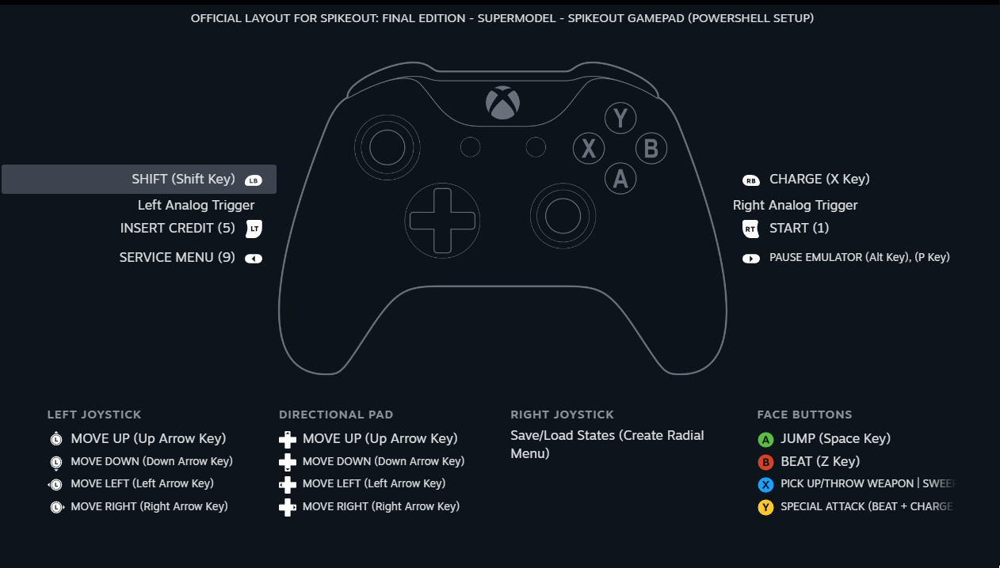

# GriekseEi-RandomPowerShellScripts

## Setup-SpikeOut.ps1

An installer script that sets up the newest version of the [Sega Model 3 Supermodel emulator](https://github.com/trzy/Supermodel), configures it and sets up shortcuts to allow playing both versions of [SpikeOut](https://en.wikipedia.org/wiki/SpikeOut) out-of-the-box (**SpikeOut ROMs are not included and must be procured yourself**), and optionally integrates them into your Steam Library. This in turn allows the script to import a custom [Steam Input](https://partner.steamgames.com/doc/features/steam_controller) controller configuration scheme that contains some useful controller macros and configs otherwise not possible with the native Supermodel input.

Overview of the custom Steam controller config:

