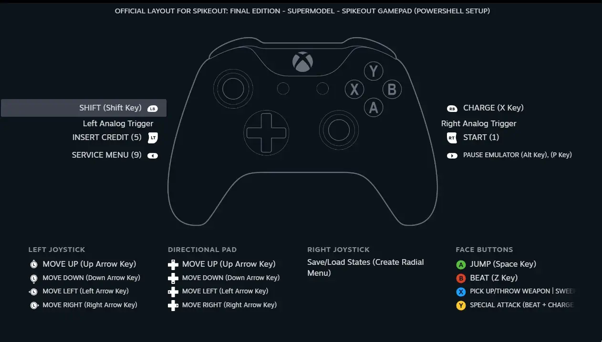

# GriekseEi-RandomPowerShellScripts

## Setup-SpikeOut.ps1

An installer script that sets up the newest version of the [Sega Model 3 Supermodel emulator](https://github.com/trzy/Supermodel), configures it and sets up shortcuts to allow playing of [SpikeOut: Digital Battle Online, and SpikeOut: Final Edition](https://en.wikipedia.org/wiki/SpikeOut) out-of-the-box (**the SpikeOut ROMs (spikeout.zip and spikeofe.zip) are not included and must be procured yourself**), and optionally integrates them into your Steam Library. This in turn allows the script to import a custom [Steam Input](https://partner.steamgames.com/doc/features/steam_controller) controller configuration scheme that contains some useful controller macros and configs.

To run this script, either download Setup-SpikeOut.ps1 from the Setup-SpikeOut folder and run it locally in a PowerShell window, or run the following commands in a PowerShell window:

```powershell
Set-ExecutionPolicy -ExecutionPolicy RemoteSigned -Scope CurrentUser
Invoke-RestMethod -Method Get 'https://raw.githubusercontent.com/GriekseEi/GriekseEi-RandomPowerShellScripts/refs/heads/main/Setup-SpikeOut/Setup-SpikeOut.ps1' | Invoke-Expression
```

Overview of the custom Steam controller config:



In case you are wondering about the differences between Digital Battle Online and Final Edition, you can find a work-in-progress changelog [here](https://docs.google.com/spreadsheets/d/12M4kS6ubeylQ5QPmV7-dQVB6Q5nLgmJoS43VLE2pOds/edit?usp=sharing).

Special thanks to RexZakel for testing out the script!
